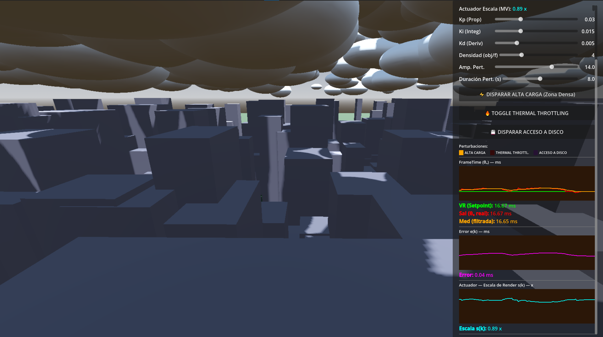

# FrameTime PID Simulator — Control PID de Escalado Dinámico de Resolución

Simulador de vuelo 3D en tiempo real que implementa un **controlador PID en software**
para mantener el frametime estable ante variaciones de carga de la GPU/CPU, ajustando
dinámicamente la escala de renderizado (`viewport.scaling_3d_scale`) en lugar de dejar
que el frame rate caiga.

## El problema que resuelve

En un simulador de vuelo, los picos de carga gráfica (zonas densas de geometría, thermal
throttling, stalls de disco) producen caídas de frametime que se sienten como microcortes.
En vez de aceptar esa degradación, este proyecto trata el frametime como la variable de
proceso de un lazo de control clásico:

- **Setpoint (SP):** 16.67 ms (60 FPS)
- **Variable de proceso (PV):** frametime medido, filtrado con un pasa-bajos para
  amortiguar el ruido de frame a frame
- **Actuador (MV):** escala de renderizado 3D, saturada entre 0.5x y 1.0x
- **Ley de control:** PID con banda muerta y purga integral (anti-windup) para evitar
  oscilaciones sostenidas

El proyecto incluye un panel HMI en vivo (tipo osciloscopio, tres paneles independientes)
para visualizar setpoint, medición, error y acción de control, además de tres
perturbaciones simulables: alta carga geométrica, thermal throttling y stall de disco
(SSD), con registro del tiempo de establecimiento (`ts`) de cada una y exportación de
telemetría a CSV.

Este proyecto nació como Trabajo Final Integrador de Tecnologías de Automatización
(UTN-FRBA) — el informe con la fundamentación matemática completa del lazo de control,
la parametrización del criterio de calidad de servicio (QoS) y el análisis crítico de
distintas sintonías del PID está en [`docs/informe-tfi.pdf`](docs/informe-tfi.pdf), con
el diagrama de bloques del sistema en [`docs/diagrama-bloques.pdf`](docs/diagrama-bloques.pdf).

## Tecnologías

- **Godot Engine 4.7** (GDScript)
- Motor de físicas: Jolt Physics
- Renderer: GL Compatibility / Direct3D 12 (Windows)

## Cómo correrlo localmente

1. Instalar [Godot 4.7](https://godotengine.org/download) (o superior compatible).
2. Clonar este repositorio.
3. Abrir `project.godot` con el editor de Godot.
4. Ejecutar la escena principal (`scenes/sistema_drs.tscn`) con F5 / botón de Play.

### Controles

- **Botón derecho + mouse:** mirar alrededor.
- Panel lateral (SCADA): sliders para Kp, Ki, Kd, densidad de objetos y parámetros de
  la perturbación de alta carga; botones para disparar cada perturbación, grabar
  telemetría a CSV, reiniciar la simulación y salir.

### Exportar un build

Los presets de exportación (Web y Windows Desktop) están definidos en
`export_presets.cfg`. Los binarios de build **no se versionan** — generalos localmente
desde el editor (`Project > Export`).

### Prototipo web (versión previa)

Antes de portar el proyecto a Godot 3D existió un prototipo 2D en HTML/JS, conservado en
[`web-prototype/`](web-prototype/) como referencia histórica del desarrollo — ver su
[README](web-prototype/README.md) para abrirlo directamente en el navegador (requiere
internet para cargar la librería de gráficos).

## Estructura del proyecto

```
project.godot                       # Configuración del proyecto Godot
export_presets.cfg                  # Presets de exportación (Web / Windows Desktop)
scenes/
  sistema_drs.tscn                  # Escena principal
scripts/
  SistemaDRS.gd                     # Lazo PID, planta simulada, generación de ciudad y perturbaciones
  MultiOsciloscopio.gd              # Panel HMI: graficado en tiempo real de SP/PV/error/actuador
  CamaraVuelo.gd                    # Control de cámara en primera persona (vuelo)
assets/
  icons/
    icon.svg                        # Ícono del proyecto
docs/
  Screen.png                        # Captura usada en este README
  informe-tfi.pdf                   # Informe académico completo (TFI, UTN-FRBA)
  diagrama-bloques.pdf              # Diagrama de bloques del lazo de control
web-prototype/
  simulador_drs.html                # Prototipo 2D previo (versión histórica)
  README.md
```

## Captura



---

Por Ignacio Pereda.
